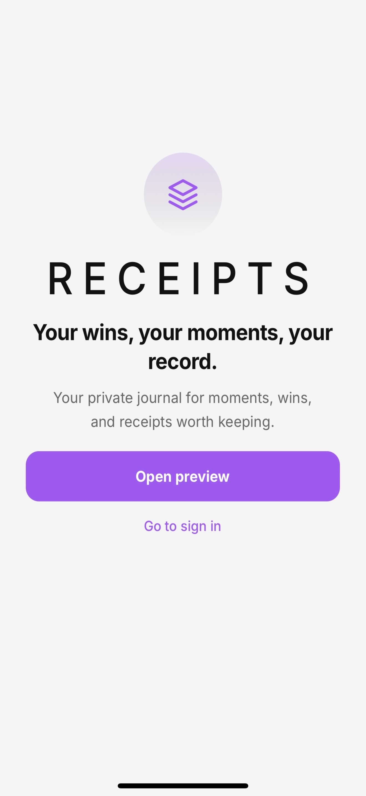
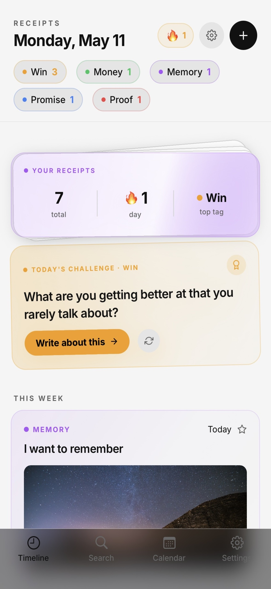
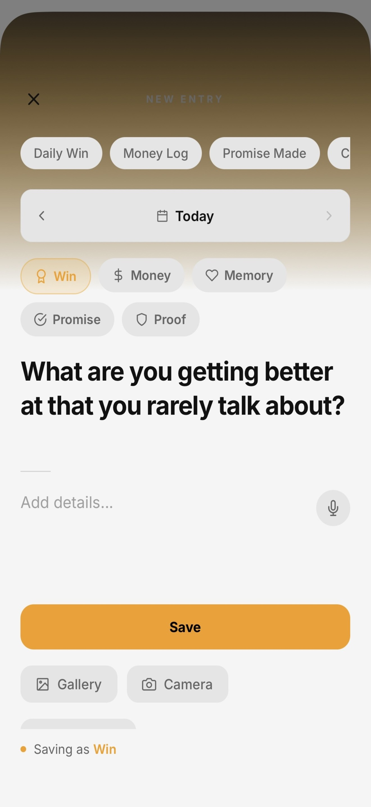
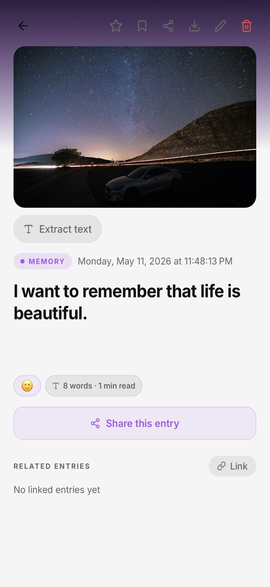
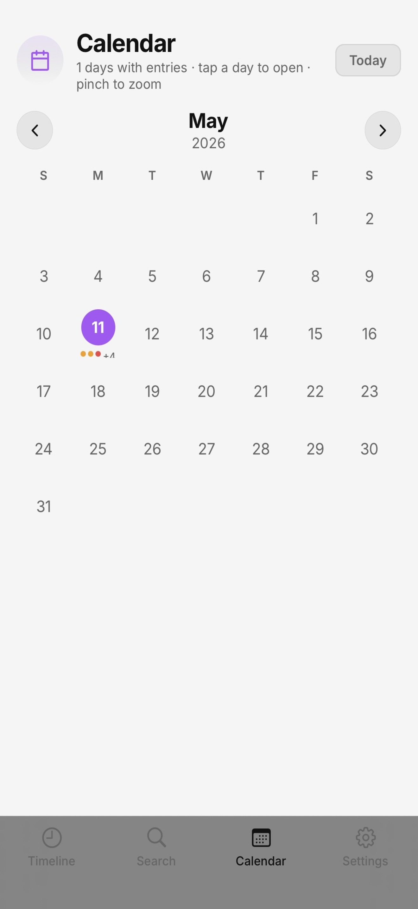
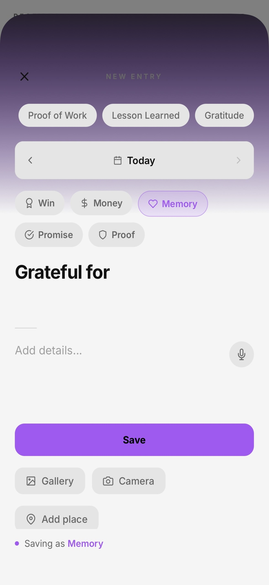

<div align="center">


# Receipts – Private Journal

### *Keep receipts on the life you're building.*

[](https://apps.apple.com)
[](https://apps.apple.com)
[](https://apps.apple.com)
[](https://expo.dev)
[](https://www.typescriptlang.org)
[](https://clerk.com)
[](https://github.com/snickpeak/Receipts/actions/workflows/ci.yml)

**A privacy-first iOS journaling app — built solo, shipped to the App Store.**

[Product Requirements](#product-requirements) · [Engineering Highlights](#engineering-highlights) · [Screenshots](#screenshots) · [Tech Stack](#tech-stack) · [SDLC](#sdlc-process) · [Docs](#product--sdlc-documentation) · [Setup](#getting-started)

</div>

---

## What This Is

Receipts is a private journaling app for people who document intentionally. No social layer, no ads, no analytics — just a fast, secure place to capture moments, wins, memories, and proof of what happened.

Built and shipped solo from concept to App Store submission. Every design decision, architecture choice, and line of code is mine.

**The core problem:** Most journaling apps are built around sharing and gamification. They turn private reflection into performance. People lose track of their own story — wins get forgotten, promises fade, moments that shaped them disappear. There was no focused, secure tool built specifically for keeping receipts on your own life.

---

## Screenshots

<div align="center">

| Landing | Timeline | New Entry |
|:---:|:---:|:---:|
|  |  |  |

| Entry Detail | Calendar | Tags in Action |
|:---:|:---:|:---:|
|  |  |  |

</div>

---

## Engineering Highlights

These are the problems that required real engineering decisions, not just implementation.

### Multi-Layer Privacy Architecture
Privacy is the product, not a feature. The app implements five independent security layers that can work in combination:

- **App-wide biometric lock** (Face ID + PIN) — blocks access before any content is visible
- **Decoy PIN mode** — a secondary PIN renders a completely clean journal state, indistinguishable from a real empty app; real data is cryptographically hidden
- **Per-entry biometric lock** — individual entries require a fresh Face ID prompt even after the app is unlocked
- **Panic Shake** — accelerometer-detected shake gesture instantly locks the app with no animation delay
- **Screenshot & screen recording prevention** — native iOS APIs block capture; background blur hides content in the app switcher

Each layer was implemented independently so they compose without conflicts and degrade gracefully if a permission is denied.

### On-Device OCR Pipeline
Text extraction from photos runs entirely on-device using `expo-text-extractor`. No image data leaves the device. The extracted text is inserted directly into the entry body, editable before saving. This required careful handling of the async extraction lifecycle within the entry compose screen to avoid race conditions with the save action.

### Offline-First Sync Architecture
Entries created without internet connectivity are queued locally and sync automatically on reconnection. The sync queue is durable across app restarts and handles partial failures gracefully. Cloud sync is opt-in — local-only mode is a first-class option, not an afterthought, with no network requests made when disabled.

### Optional End-to-End Encryption
When enabled, entries are encrypted on-device using the user's PIN as the key material before being transmitted to the server. The server stores only ciphertext. Implemented via `lib/cryptoLib.ts` with key derivation tied to the user's local PIN.

### Tamper Detection via Hash Chain
Each entry is hashed using FNV-1a and linked to the previous entry's hash, forming a blockchain-style chain. Any modification to entry data outside the app breaks the chain, and the user is alerted. This was motivated by use cases where entries serve as personal proof or documentation.

### Semantic Search
Beyond keyword search, entries are indexed using TF-IDF ranking for semantic relevance. A search for "difficult conversation" can surface entries about conflict, disagreement, or hard feedback even if those exact words don't appear. Implemented in `lib/semanticSearch.ts` without any external search service.

### Animated Intro — No Flash, Every Launch
The intro sequence (3D logo video → Blankit handwriting font reveal) required eliminating the white flash that typically appears before a React Native video component renders. Solved by rendering the overlay always-on from app start, keeping landing content hidden until the intro state machine completes. The letter reveal animation runs at 150ms stagger per letter, 450ms duration, 1.5s total — tuned to feel handwritten without being slow.

---

## Core Features

**Entry Creation**
- Rich text entries with title and body
- Photo attachments (camera or gallery) with optional metadata stripping
- On-device OCR — extract text from any photo into the entry
- Voice memo recording and playback
- Emoji mood per entry
- GPS auto-tagging or manual place search
- Custom tags with color and icon (defaults: Win, Money, Memory, Promise, Proof)
- Link related entries together

**Organization**
- Timeline grouped by Today / Yesterday / This Week / Earlier with tag filtering
- Pin up to 5 entries to a horizontal strip at the top of the timeline
- Semantic + keyword search across all entries
- Calendar view with 12-week activity heatmap
- On This Day — entries from the same date in prior years
- Memory Threads — clusters related entries by tag and time proximity
- Places — all geo-tagged entries in one view
- Trash with 30-day soft delete before permanent purge

**Privacy & Security**
- App-wide biometric lock (Face ID + PIN fallback)
- Decoy PIN mode — secondary PIN shows empty journal
- Per-entry biometric lock
- Panic Shake to instantly lock
- Screenshot and screen recording prevention
- Background blur in app switcher
- Optional end-to-end encryption for cloud sync
- Tamper detection via FNV-1a hash chain
- Local-only mode (no server communication)
- Guest mode (no account required)

**Insights**
- Weekly Digest — entries, word count, heatmap, top words, mood breakdown
- Journaling streak with milestone animations

**Data & Portability**
- Markdown export (full journal or individual entries)
- Offline-first sync queue
- Full data ownership — export anytime, delete anytime

---

## Tech Stack

| Layer | Technology | Why |
|---|---|---|
| Language | TypeScript 5.9 (strict) | Type safety across the entire codebase |
| Framework | React Native 0.81.5 | iOS and Android from one codebase |
| SDK | Expo SDK 54 | Managed workflow, fast iteration, EAS integration |
| Navigation | Expo Router 6 (file-based) | Maintainable routing without a router config file |
| Auth | Clerk (`@clerk/expo` v3) | Production-grade auth without building session management |
| Server State | TanStack Query v5 | Optimistic updates, cache, background refetch |
| Animations | React Native Reanimated 4 | 60fps animations on the UI thread |
| Local Storage | AsyncStorage + SecureStore | General data + encrypted sensitive values |
| Build & Deploy | EAS Build + EAS Submit | CI/CD pipeline to App Store with one command |
| Package Manager | pnpm | Faster installs, strict dependency resolution |
| React Compiler | Enabled (experimental) | Automatic memoization without manual optimization |
| New Architecture | Enabled | Concurrent rendering, better performance |

---

## Product & SDLC Documentation

Full product and program management documentation lives in `/docs`:

| Document | Description |
|---|---|
| [PRD](./docs/PRD.md) | Product requirements, problem statement, target users, goals, user flows, success metrics |
| [User Stories](./docs/USER_STORIES.md) | 30 user stories across 9 feature areas with acceptance criteria and status labels |
| [Roadmap](./docs/ROADMAP.md) | v1.0 shipped features, v1.1 near-term, v2.0 future vision, technical debt |
| [Architecture](./docs/ARCHITECTURE.md) | System diagram, data flows, privacy model, and layer-by-layer breakdown |
| [Decisions](./docs/DECISIONS.md) | 8 Architecture Decision Records — context, options considered, and rationale for key choices |
| [QA Test Plan](./docs/QA_TEST_PLAN.md) | 100+ manual test cases across launch, auth, entries, privacy, data, and release readiness |
| [Release Checklist](./docs/RELEASE_CHECKLIST.md) | App Store Connect, TestFlight, privacy/legal, and pre-submission checklist with status |
| [Backlog](./docs/BACKLOG.md) | MoSCoW prioritized backlog — 30 items with feature, rationale, and status |

---

## SDLC Process

This project followed a complete software development lifecycle from concept to App Store submission.

**Discovery & Scoping**
Identified the gap in the journaling market — apps optimized for sharing, not privacy. Scoped MVP around three jobs: capture a moment fast, organize entries for retrieval, and protect data from anyone who isn't the user.

**Architecture**
Selected React Native + Expo for cross-platform potential and a production-grade managed workflow. Chose file-based routing (Expo Router) to keep navigation maintainable without a centralized router config. Used Clerk to avoid building custom session management. Designed the data model around an offline-first principle — local storage is the source of truth, cloud sync is additive.

**Development**
Built in vertical slices: auth flow → core entry CRUD → search and calendar → advanced features (OCR, voice, biometric lock, decoy mode, E2E encryption). TypeScript strict mode enabled throughout. React Compiler enabled for automatic memoization.

**Quality**
TypeScript compiler (`tsc --noEmit`) as primary static analysis. Tested on physical iPhone hardware across all main user flows. Full manual QA checklist documented — see [QA Test Plan](./docs/QA_TEST_PLAN.md).

**Build & Release**
EAS Build configured with `development`, `preview`, and `production` profiles. Production iOS build auto-submitted to TestFlight via `eas build --auto-submit`. Build 31 (v1.0.0) submitted to Apple App Store Review on May 22, 2026.

**Privacy & Compliance**
Apple Privacy Manifest completed. NSUsageDescription strings written for all sensitive APIs (Face ID, camera, microphone, location). `ITSAppUsesNonExemptEncryption: false` declared. No third-party analytics or advertising SDKs included. Privacy policy published and linked in App Store Connect.

---

## Project Structure

```
├── app/                        # File-based routes (Expo Router)
│   ├── (auth)/                 # Sign in / Sign up screens
│   ├── (tabs)/                 # Bottom tab navigator
│   │   ├── index.tsx           # Timeline — home feed
│   │   ├── search.tsx          # Semantic + keyword search
│   │   ├── calendar.tsx        # Calendar heatmap view
│   │   └── settings.tsx        # Settings and preferences
│   ├── add.tsx                 # New entry composer
│   ├── entry/[id].tsx          # Entry detail and edit
│   ├── digest.tsx              # Weekly digest
│   ├── threads.tsx             # Memory threads
│   ├── places.tsx              # Geo-tagged entries
│   ├── trash.tsx               # Deleted entries (30-day hold)
│   ├── onboarding.tsx          # First-run onboarding
│   ├── _layout.tsx             # Root layout + all providers
│   └── index.tsx               # Landing page + intro overlay
├── assets/
│   ├── fonts/                  # Blankit custom font
│   ├── images/                 # App icon
│   └── videos/                 # 3D intro animation
├── components/                 # Shared UI components
├── context/                    # React context (settings, entries, auth)
├── hooks/                      # Custom hooks (haptics, reduced motion, etc.)
├── lib/                        # Core logic (search, crypto, sync, export, OCR)
├── constants/                  # Colors, theme tokens
├── types/                      # TypeScript type definitions
├── i18n/                       # Localization strings (English + Ethiopic)
├── screenshots/                # App Store and GitHub screenshots
├── docs/                       # Product and SDLC documentation
├── app.json                    # Expo configuration
└── eas.json                    # EAS build and submit profiles
```

---

## Roadmap

Full roadmap with rationale in [docs/ROADMAP.md](./docs/ROADMAP.md).

| Release | Focus | Status |
|---|---|---|
| v1.0 | Full iOS feature set, App Store launch | Under Review |
| v1.1 | Android via Google Play, rating prompt, polish | Planned |
| v2.0 | Freemium tier, iCloud sync, Apple Watch, on-device AI | Planned |

---

## Getting Started

### Prerequisites
- Node.js 18+
- pnpm (`npm install -g pnpm`)
- Expo CLI (`npm install -g expo-cli`)
- iOS device or Simulator

### Install

```bash
git clone https://github.com/snickpeak/Receipts.git
cd Receipts
pnpm install
```

### Environment Variables

```env
EXPO_PUBLIC_CLERK_PUBLISHABLE_KEY=your_clerk_publishable_key
```

### Run

```bash
pnpm dev
```

Press `i` for iOS Simulator or scan the QR code with Expo Go.

### Production Build

```bash
eas build --platform ios --profile production --auto-submit
```

---

## License

MIT — see [LICENSE](./LICENSE) for details.

---

<div align="center">

Built by **[snickpeak](https://github.com/snickpeak)** · Support: receipts.support@gmail.com

</div>
