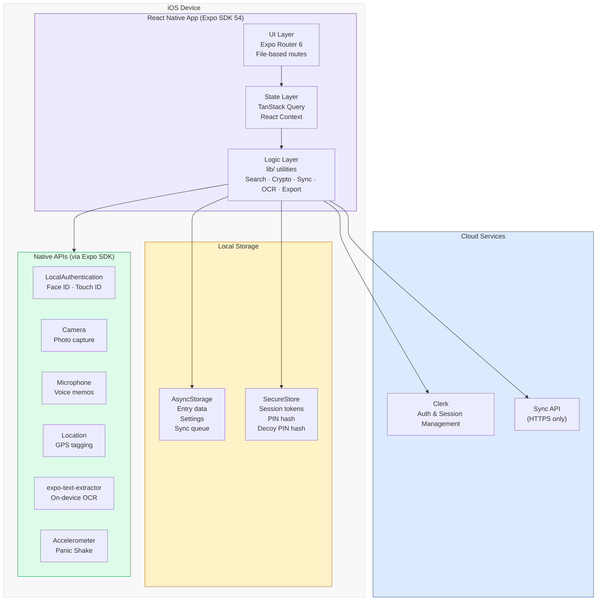
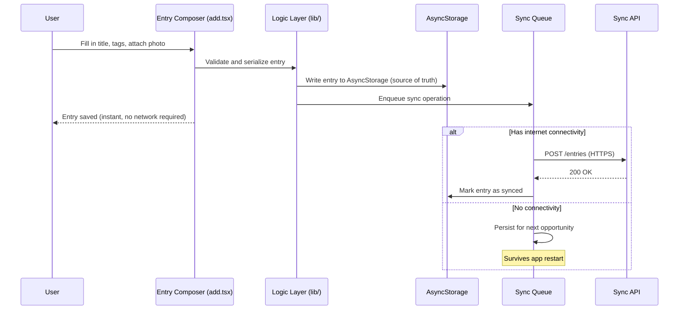
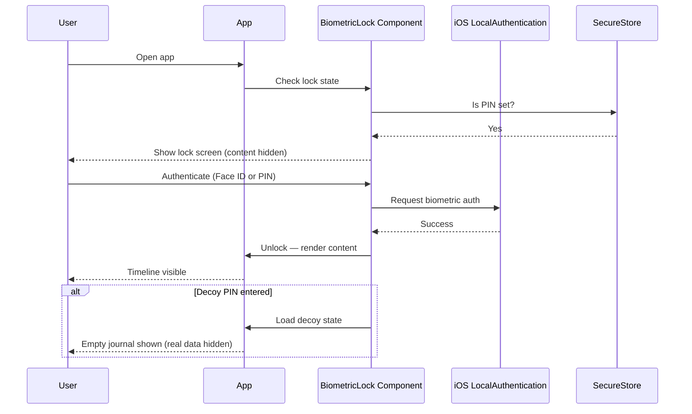

# System Architecture
## Receipts – Private Journal
**Last Updated:** May 2026

---

## Overview

Receipts is an offline-first iOS journaling app. The architecture is designed around one constraint: user data must be private, portable, and accessible without internet connectivity. Every layer reflects that constraint.

---

## System Diagram



---

## Layer Breakdown

### UI Layer — `app/`

File-based routing via Expo Router 6. Each file in `app/` is a route. Route groups `(auth)` and `(tabs)` handle navigation structure without affecting the URL path.

Key screens:
- `app/index.tsx` — landing page with intro overlay state machine
- `app/(tabs)/index.tsx` — timeline with pinned strip, tag filters, On This Day
- `app/add.tsx` — entry composer (the most complex screen)
- `app/entry/[id].tsx` — entry detail and edit with per-entry lock
- `app/(auth)/` — Clerk-backed sign in and sign up

### State Layer — Context + TanStack Query

- **TanStack Query** manages all server state: fetching, caching, background refetch, optimistic updates
- **React Context** manages client state: settings, auth session, entries list, theme
- The two layers are kept separate — server state never lives in Context and client state never lives in Query

### Logic Layer — `lib/`

Pure utility functions with no UI dependencies. Key modules:

| Module | Responsibility |
|---|---|
| `syncQueue.ts` | Durable offline-first queue; survives app restarts |
| `cryptoLib.ts` | Key derivation and entry encryption/decryption for E2E mode |
| `semanticSearch.ts` | TF-IDF indexing and relevance ranking across all entries |
| `imageOcr.ts` | On-device text extraction from photos via expo-text-extractor |
| `exportLib.ts` | Markdown serialization for full journal and individual entries |
| `streakLib.ts` | Consecutive day tracking and milestone detection |
| `tagsLib.ts` | Tag CRUD, color resolution, icon mapping |

### Storage

Two storage mechanisms, used for different data sensitivity levels:

| Store | What goes here |
|---|---|
| AsyncStorage | Entry data, settings, sync queue, tag definitions |
| SecureStore | Session tokens (via Clerk), PIN hash, decoy PIN hash |

SecureStore uses iOS Keychain under the hood — hardware-backed, encrypted, inaccessible to other apps.

### Native APIs

All native integrations go through Expo SDK wrappers. No custom native modules are required.

---

## Data Flow — Creating an Entry



---

## Data Flow — Biometric Lock



---

## Privacy Architecture

The privacy model has five independent layers. Each layer addresses a different threat:

| Layer | Threat Addressed | Implementation |
|---|---|---|
| App-wide biometric lock | Casual physical access | `BiometricLock.tsx` — wraps all content |
| Decoy PIN mode | Coercion / forced access | Secondary PIN → empty journal state in `_layout.tsx` |
| Per-entry lock | Access with unlocked phone | Fresh biometric prompt in `entry/[id].tsx` |
| Panic Shake | Surprise / emergency lock | Accelerometer in `_layout.tsx` → instant lock |
| Screenshot prevention | Screen capture / recording | `expo-screen-capture` in `_layout.tsx` |
| Background blur | App switcher exposure | Blur overlay on `AppState` change |
| Optional E2E encryption | Server-side data exposure | `cryptoLib.ts` — encrypt before sync |

These layers are independent — each can be enabled or disabled without affecting the others.

---

## Security Boundaries

```
┌─────────────────────────────────────────────┐
│                   Device                    │
│  ┌───────────────────────────────────────┐  │
│  │              App Process              │  │
│  │  ┌─────────────────────────────────┐  │  │
│  │  │        SecureStore (Keychain)   │  │  │
│  │  │  · Session tokens               │  │  │
│  │  │  · PIN hash                     │  │  │
│  │  │  · Decoy PIN hash               │  │  │
│  │  └─────────────────────────────────┘  │  │
│  │  ┌─────────────────────────────────┐  │  │
│  │  │        AsyncStorage             │  │  │
│  │  │  · Entry data (plaintext)       │  │  │
│  │  │  · OR ciphertext (E2E mode)     │  │  │
│  │  └─────────────────────────────────┘  │  │
│  └───────────────────────────────────────┘  │
└─────────────────────────────────────────────┘
         │ HTTPS only │ Clerk SDK only
         ▼             ▼
   ┌──────────┐  ┌──────────────┐
   │ Sync API │  │ Clerk (Auth) │
   └──────────┘  └──────────────┘
```

No user data is transmitted outside these two channels. No analytics, advertising, or crash reporting services receive any user data.
